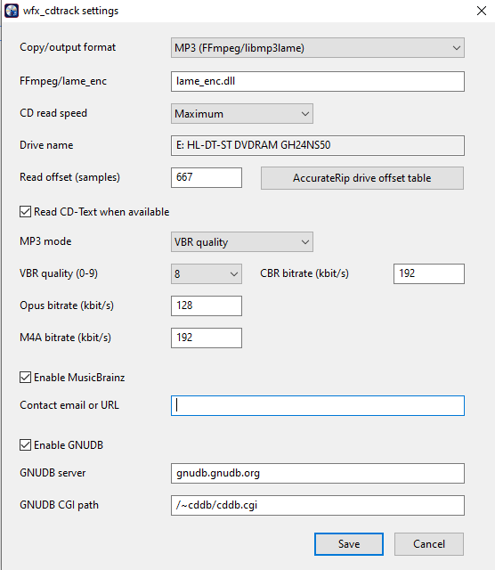
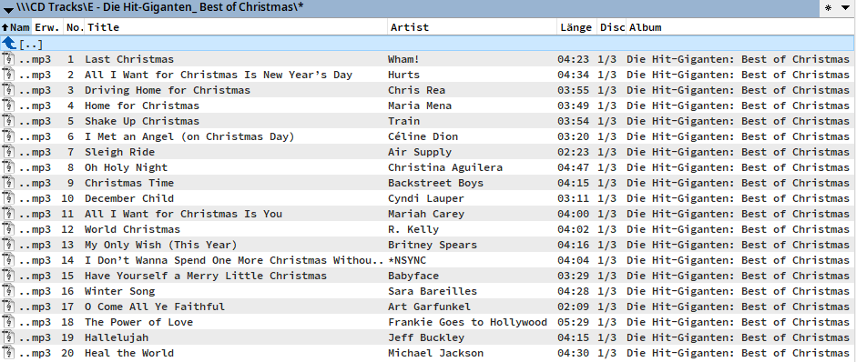

# wfx_cdtrack




`wfx_cdtrack` is a Total Commander 11.x file-system plugin for Windows. It
shows every optical drive, exposes audio-CD tracks as virtual audio files,
retrieves metadata from MusicBrainz and GNUDB, and copies tracks as WAV, raw
CDDA, MP3, Opus, or M4A.

The `Disc` custom field displays the medium position of multi-disc releases as
`1/3`. MusicBrainz matching selects only the medium associated with the inserted
disc ID; the same value is written to encoded-file metadata.

For a formatted track duration, use the custom field `[=<fs>.Duration mm ss]`.
It displays values such as `04:37` without a unit.

The project is intended for non-commercial use.

The plugin icon combines an audio compact disc, a file-panel/folder symbol,
and a music note. Its editable source artwork is stored under `assets` and the
multi-resolution Windows icon is embedded into both plugin binaries.

## Installation

Builds are in `release`:

- `cdtrack.wfx` for 32-bit Total Commander
- `cdtrack.wfx64` for 64-bit Total Commander

Keep both files and `pluginst.inf` in the same directory. Open the ZIP/package
from Total Commander for automatic installation, or add the plugin under
**Configuration > Options > Plugins > File system plugins**.

## Configuration

Open the virtual `Settings` directory in the plugin root. Entering the folder
directly opens the native settings window, which configures the output format,
FFmpeg, encoder quality/bitrates, MusicBrainz, and GNUDB. Saving writes the
values to `cdtrack.ini` next to `cdtrack.wfx` and `cdtrack.wfx64`. The plugin
does not store these settings in `wincmd.ini`. Both plugin architectures and
multiple Total Commander instances use the same `cdtrack.ini`.
The dialog uses per-monitor DPI awareness, DPI-scaled geometry, and a scaled
Segoe UI font. The temporary thread DPI context is restored when it closes.

The same values can also be edited manually in `cdtrack.ini`:

```ini
[Encoding]
Format=wav
FFmpegPath=C:\Tools\ffmpeg\bin\ffmpeg.exe

[MP3]
Mode=vbr
Quality=2
Bitrate=192

[Opus]
Bitrate=128

[M4A]
Bitrate=192

[MusicBrainz]
Contact=you@example.org
```

`Format` accepts `wav`, `cdda`, `mp3`, `opus`, or `m4a`. CDDA writes the raw
2352-byte audio sectors without a container header. The selected format determines
the extension shown in the panel and the conversion performed by F5/Copy.

Total Commander receives continuous progress percentages while sectors are read.
Canceling the transfer stops the drive read and removes an incomplete output
file. FFmpeg conversions reserve the final part of the progress range for the
encoder step.
For MP3, `Mode=vbr` uses the LAME quality scale (`Quality=0..9`), while
`Mode=cbr` uses the fixed `Bitrate` in kbit/s (32..320).

MusicBrainz is disabled until `Contact` contains a real maintainer email address
or public project/contact URL. It is included in the required User-Agent.
MusicBrainz is queried first. GNUDB is queried only as a fallback when
MusicBrainz returns no matches, is disabled or unavailable, or reports an error.
GNUDB remains available without a MusicBrainz contact setting. Metadata
selections are cached in a sidecar `*.cdtrack-cache.ini` file.

## FFmpeg and lame_enc.dll

WAV export is built in. MP3 can use either `ffmpeg.exe` or `lame_enc.dll`.
Select the desired file in the `FFmpeg/lame_enc` setting. When that path points
to `lame_enc.dll`, MP3 is encoded directly through the Blade/LAME DLL interface,
including the configured CBR/VBR mode and ID3 metadata. The DLL architecture
must match Total Commander and the plugin: a 32-bit DLL for `cdtrack.wfx`, or a
64-bit DLL for `cdtrack.wfx64`.

You may enter only a filename such as `lame_enc.dll` or `ffmpeg.exe`; in that
case the plugin searches for it in its own plugin directory.

Opus and M4A require `ffmpeg.exe`. If the configured path points to
`lame_enc.dll`, the plugin still searches automatically for FFmpeg when one of
these formats is selected. Install a Windows build linked from the
[official FFmpeg download page](https://ffmpeg.org/download.html) and either
select it in `FFmpeg/lame_enc`, put it in a `tools` directory next to the plugin,
or add it to `PATH`.

FFmpeg normally uses `libmp3lame` for MP3, `libopus` for Opus, and its AAC
encoder for M4A. Check the license of the FFmpeg build you choose; FFmpeg builds
can have different GPL/LGPL and third-party codec terms. No FFmpeg or codec
binary is distributed by this project. See the official
[FFmpeg legal information](https://ffmpeg.org/legal.html),
[LAME project](https://lame.sourceforge.io/), and
[Opus codec](https://opus-codec.org/).

## Metadata services

- [MusicBrainz Web Service](https://musicbrainz.org/doc/MusicBrainz_API) uses
  HTTPS, a MusicBrainz Disc ID, and a mandatory meaningful User-Agent.
- [MusicBrainz rate limiting](https://musicbrainz.org/doc/MusicBrainz_API/Rate_Limiting)
  applies. Do not run anonymous or high-volume automated lookups.
- [GNUDB](https://gnudb.org/) is queried through its FreeDB/CDDB-compatible HTTP
  endpoint.

If multiple releases match, the best-scoring result is presented first. Choose
Yes to accept it, No to inspect the next result, or Cancel to retain generic
track names.

## Custom columns

The WFX content interface exposes Artist, Track number, Duration seconds,
Duration mm:ss, Album, Title, Year, Genre, Drive, Start sector, and Sector
count. Neither duration field defines a unit. Default-view references use the
WFX placeholder prefix, for example `[=<fs>.Title]`.

## Building

Requirements: Lazarus 4.8 and FPC 3.2.2 with Win32 and Win64 targets.

```powershell
C:\Users\Alexander\lazarus\lazbuild.exe -B --build-mode="Release 64" cdtrack.lpi
C:\Users\Alexander\lazarus\lazbuild.exe -B --build-mode="Release 32" cdtrack.lpi
```

## Limitations

- Audio extraction requires a physical drive supporting Windows raw CDDA reads.
- Mixed-mode and damaged discs depend on drive/driver behavior.
- Online lookup currently happens while a newly inserted disc is first listed.
- Encoded file sizes shown before copying are estimates based on PCM size.
